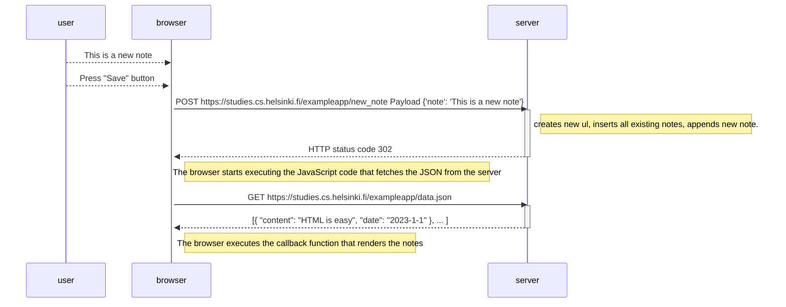

```mermaid
sequenceDiagram
    participant user
    participant browser
    participant server

    user-->>browser: This is a new note
    activate browser
    user-->>browser: Press "Save" button
    browser->>server: POST https://studies.cs.helsinki.fi/exampleapp/new_note Payload {'note': 'This is a new note'}
    activate server
    Note right of server: creates new ul, inserts all existing notes, appends new note.
    server-->>browser: HTTP status code 302
    deactivate server

    Note right of browser: The browser starts executing the JavaScript code that fetches the JSON from the server

    browser->>server: GET https://studies.cs.helsinki.fi/exampleapp/data.json
    activate server
    server-->>browser: [{ "content": "HTML is easy", "date": "2023-1-1" }, ... ]
    deactivate server

    Note right of browser: The browser executes the callback function that renders the notes
```
