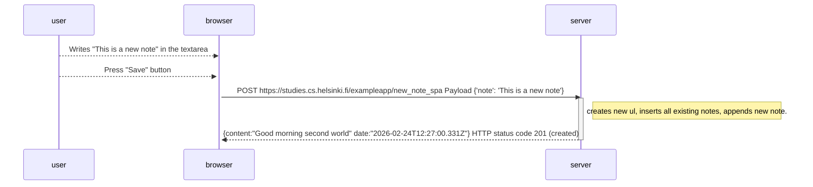

```mermaid
sequenceDiagram
    participant user
    participant browser
    participant server

    user-->>browser: Writes "This is a new note" in the textarea
    activate browser
    user-->>browser: Press "Save" button
    browser->>server: POST https://studies.cs.helsinki.fi/exampleapp/new_note_spa Payload {'note': 'This is a new note'}
    activate server
    Note right of server: creates new ul, inserts all existing notes, appends new note.
    server-->>browser: {content:"Good morning second world" date:"2026-02-24T12:27:00.331Z"} HTTP status code 201 (created)
    deactivate server
```
